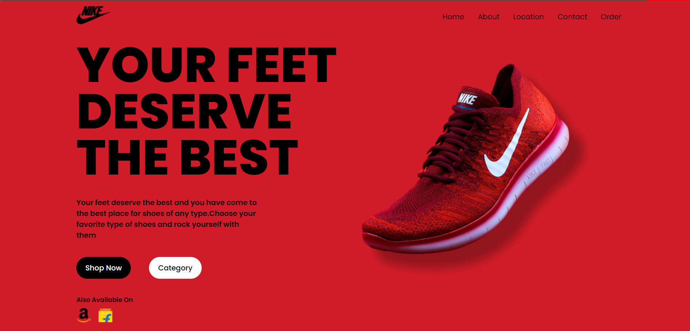

# Nike Brand Page

This project is a Nike brand landing page created using React.

## Table of Contents

- [Demo](#demo)
- [Installation](#installation)
- [Usage](#usage)
- [Project Structure](#project-structure)
- [Technologies Used](#technologies-used)
- [Contributing](#contributing)
- [License](#license)


## Demo



## Installation

1. Clone the repository:

```bash
git clone https://github.com/your-username/nike-brand-page.git
```

2. Navigate to the project directory:

```bash
cd nike-brand-page
```

3. Install the dependencies:

```bash
npm install
```

## Usage

To run the project locally, use the following command:

```bash
npm start
```

This will start the development server, and you can view the page by navigating to `http://localhost:3000` in your web browser.

## Project Structure

The project structure is as follows:

```
nike-brand-page/
├── public/
│   ├── index.html
│   └── ...
├── src/
│   ├── assets/
│   │   └── images/
│   │       └── brand-page.png
│   ├── components/
│   │   └── YourComponent.jsx
│   ├── App.css
│   ├── App.js
│   ├── index.css
│   ├── index.js
│   └── ...
├── .gitignore
├── package-lock.json
├── package.json
└── README.md
```

## Technologies Used

- React
- HTML5
- CSS3

## Contributing

Contributions are welcome! Please follow these steps to contribute:

1. Fork the repository.
2. Create a new branch (`git checkout -b feature/your-feature`).
3. Commit your changes (`git commit -m 'Add some feature'`).
4. Push to the branch (`git push origin feature/your-feature`).
5. Open a pull request.

## License

This project is licensed under the MIT License. See the [LICENSE](LICENSE) file for details.